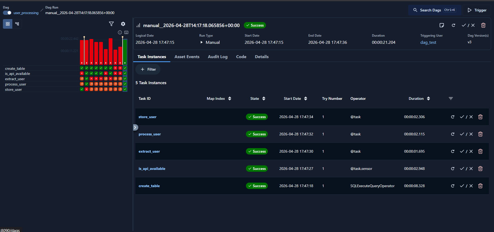
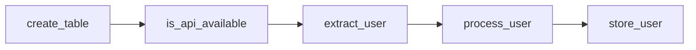

# 📦 User Processing Pipeline

A production-ready **Apache Airflow DAG** that fetches user data from a fake JSON API, performs data transformation, stores it as a CSV file, and **bulk-loads** it into a PostgreSQL database. The pipeline includes an API sensor to ensure availability before processing the data.

## ✨ Features

- ✅ **API Availability Sensor** – Waits for the external API to be reachable (pokes every 30 s, up to 5 min) before proceeding.
- ✅ **Data Extraction & Transformation** – Extracts only the required fields (`id`, `firstname`, `lastname`, `email`) from the raw JSON.
- ✅ **Timestamp Enrichment** – Adds a `created_at` timestamp to each user record.
- ✅ **CSV Persistence** – Writes the processed user record to a local CSV file (`/tmp/user_info.csv`).
- ✅ **Efficient Bulk Load** – Uses PostgreSQL’s `COPY` command to bulk‑insert the CSV data into a database table.
- ✅ **Idempotent Table Creation** – Creates the `users` table if it does not already exist.

## 🧠 How It Works

The DAG consists of five tasks executed in the following order:

1. **`create_table`** – Creates a `users` table in PostgreSQL with the schema:
   ```sql
   CREATE TABLE IF NOT EXISTS users (
       id INT PRIMARY KEY,
       firstname VARCHAR(255),
       lastname VARCHAR(255),
       email VARCHAR(255),
       created_at TIMESTAMP DEFAULT CURRENT_TIMESTAMP
   )
   ```

2. **`is_api_available`** – A sensor that pokes the external JSON API (`https://raw.githubusercontent.com/marclamberti/datasets/refs/heads/main/fakeuser.json`) every 30 seconds (timeout after 5 minutes). Once the API returns a `200` status, the sensor retrieves the raw user data and passes it downstream via **XCom**.

3. **`extract_user`** – Receives the raw JSON, extracts only the relevant fields (`id`, `firstname`, `lastname`, `email`), and returns a clean dictionary.

4. **`process_user`** – Adds a `created_at` timestamp and writes the record to a CSV file (`/tmp/user_info.csv`).

5. **`store_user`** – Uses `PostgresHook.copy_expert` to bulk‑load the CSV file into the `users` table.

The execution graph (screenshot below) shows the linear dependency:  
`create_table → is_api_available → extract_user → process_user → store_user`.



## 🗺️ Architecture Flow



## 📋 Prerequisites

- **Apache Airflow** 2.5+ (tested with 3.2.1 as per `requirements.txt`)
- **PostgreSQL** database accessible from the Airflow environment
- Airflow providers:
  - `apache-airflow-providers-postgres`
  - `apache-airflow-providers-common-sql`
- Python library: `requests` (already included in the provider dependencies)

## 🛠 Installation & Setup

1. **Clone the repository** (or copy the files into your Airflow `dags` folder):
   ```bash
   git clone https://github.com/NavidAhmadiii/User-Processing-Pipeline.git
   ```

2. **Install dependencies** (preferably inside a virtual environment):
   ```bash
   pip install -r requirements.txt
   ```

3. **Place the DAG file** – Copy `user_processing.py` into your Airflow `dags` directory (e.g., inside a subfolder `user-processing/`).

4. **Configure the PostgreSQL connection** in the Airflow UI (see below).

## ⚙️ Configuration

### Airflow Connection

Create a **Postgres connection** with the connection ID `postgres`:

| Field      | Value                     |
|------------|---------------------------|
| Conn Type  | Postgres                  |
| Host       | Postgres                  |
| Login      | airflow                   |
| Password   |                           |
| Port       | 5432 (default)            |

### DAG Location

Airflow automatically discovers DAGs in all subfolders of the `dags` directory.  
Example structure:
```
dags/
└── user-processing/
    └── user_processing.py
```

## 📂 File Structure

```
user-processing-pipeline/
├── user_processing.py   # Main DAG definition
├── requirements.txt     # Python dependencies
├── image.png            # Screenshot of the DAG graph
└── README.md            # This file
```

## 🚀 Usage

1. **Start Airflow** – Ensure the scheduler and webserver are running:
   ```bash
   airflow scheduler
   airflow webserver
   ```

2. **Trigger the DAG** – In the Airflow UI, locate the DAG named `user_processing` and trigger it manually.

3. **Monitor the run** – The DAG will wait for the API to respond, then process and load the data.

4. **Verify the result** – After a successful run, check the `users` table in your PostgreSQL database. It should contain the fetched fake user record.

## 📌 Notes

- **No schedule by default** – The DAG currently runs only on manual triggers. To automate it, add a `schedule` parameter (e.g., `@daily`) to the `@dag` decorator in the code.
- **CSV file location** – The pipeline writes to `/tmp/user_info.csv`. In multi‑worker production setups, consider using an in‑memory buffer or object storage (e.g., S3) instead of a local temporary file.
- **Sensitive information** – Never hard‑code passwords, connection strings, or API keys in the DAG file. Store them in Airflow Connections or a secrets backend.
- **API endpoint** – The DAG retrieves data from a static JSON file hosted on GitHub. For real‑world usage, replace it with your own API endpoint.
- **Error handling** – The sensor and tasks do not include extensive error handling. For production, consider adding retries, alerting, and dead‑letter queues.

## 🤝 Contributing

Contributions are welcome! Please open an issue or submit a pull request for any improvements, bug fixes, or additional features.

## 📄 License

This project is for learning purposes. Feel free to use, modify, and distribute it. No explicit license file is provided, but the author (Navid Ahmadi) permits educational and personal use. For commercial use, please contact the repository author.

---
